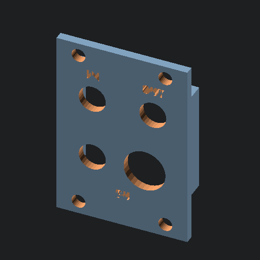

# Preview images

Generated by `generate_readme.sh` on Sat Sep  2 16:20:07 PDT 2023.

## `19inch_rack_mount/eurorack_rails.scad`

source: [19inch_rack_mount/eurorack_rails.scad](19inch_rack_mount/eurorack_rails.scad)

## `19inch_rack_mount/rack_ear.scad`

source: [19inch_rack_mount/rack_ear.scad](19inch_rack_mount/rack_ear.scad)

## `19inch_rack_mount/volca.scad`

source: [19inch_rack_mount/volca.scad](19inch_rack_mount/volca.scad)

## `adapters/korg_sq1_adapter.scad`

source: [adapters/korg_sq1_adapter.scad](adapters/korg_sq1_adapter.scad)

## `eurorack_front_panels/attenuverter_meter.scad`

source: [eurorack_front_panels/attenuverter_meter.scad](eurorack_front_panels/attenuverter_meter.scad)

## `eurorack_front_panels/blank_panel.scad`

source: [eurorack_front_panels/blank_panel.scad](eurorack_front_panels/blank_panel.scad)

## `eurorack_front_panels/dual_meters.scad`

source: [eurorack_front_panels/dual_meters.scad](eurorack_front_panels/dual_meters.scad)

## `eurorack_front_panels/dual_vca.scad`

source: [eurorack_front_panels/dual_vca.scad](eurorack_front_panels/dual_vca.scad)

## `eurorack_front_panels/dual_vca_v2.scad`

source: [eurorack_front_panels/dual_vca_v2.scad](eurorack_front_panels/dual_vca_v2.scad)

## `eurorack_front_panels/fm_synth.scad`

source: [eurorack_front_panels/fm_synth.scad](eurorack_front_panels/fm_synth.scad)

## `eurorack_front_panels/front_panel_common.scad`

source: [eurorack_front_panels/front_panel_common.scad](eurorack_front_panels/front_panel_common.scad)

## `eurorack_front_panels/panel_common.scad`

source: [eurorack_front_panels/panel_common.scad](eurorack_front_panels/panel_common.scad)

## `eurorack_front_panels/vca_common.scad`

source: [eurorack_front_panels/vca_common.scad](eurorack_front_panels/vca_common.scad)

## `one_u_tiles/blank_tile.scad`

source: [one_u_tiles/blank_tile.scad](one_u_tiles/blank_tile.scad)

## `one_u_tiles/four_jacks.scad`

source: [one_u_tiles/four_jacks.scad](one_u_tiles/four_jacks.scad)

## `one_u_tiles/game_of_life.scad`

source: [one_u_tiles/game_of_life.scad](one_u_tiles/game_of_life.scad)

## `one_u_tiles/label_test.scad`

source: [one_u_tiles/label_test.scad](one_u_tiles/label_test.scad)

## `one_u_tiles/one_pot_three_jacks.scad`

source: [one_u_tiles/one_pot_three_jacks.scad](one_u_tiles/one_pot_three_jacks.scad)

## `one_u_tiles/one_pot_two_jacks.scad`

source: [one_u_tiles/one_pot_two_jacks.scad](one_u_tiles/one_pot_two_jacks.scad)

## `one_u_tiles/opl2_vco.scad`

source: [one_u_tiles/opl2_vco.scad](one_u_tiles/opl2_vco.scad)

## `one_u_tiles/six_jacks.scad`

source: [one_u_tiles/six_jacks.scad](one_u_tiles/six_jacks.scad)

## `one_u_tiles/tile_common.scad`

source: [one_u_tiles/tile_common.scad](one_u_tiles/tile_common.scad)

